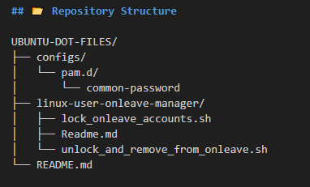

# My Linux Dotfiles

Welcome to my personal Linux dotfiles repository! This collection is designed to streamline my workflow, enhance system security, and provide useful administration utilities on Debian-based systems like Ubuntu.

---

## 🚀 Overview

This repository contains my essential configuration files and a handy script for system management. Key components include:

* **`linux-user-onleave-manager`**: A simple Bash script to manage Linux user accounts (enable/disable) for scenarios like holidays or extended absences.
* **`common-password` configuration**: A hardened PAM configuration for `/etc/pam.d/common-password` to enforce strong password quality policies system-wide.

---

## 📂 Repository Structure
